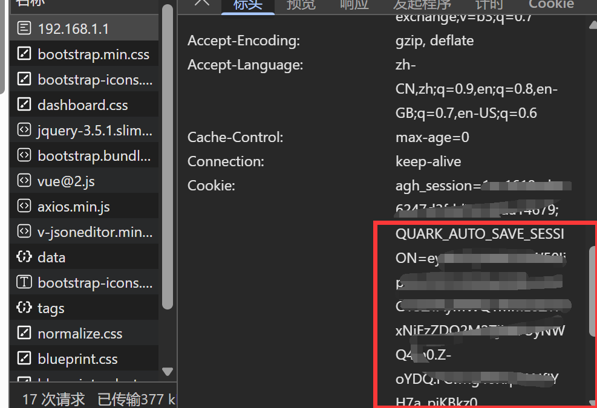

# Astrbot_plugin_quarksave

AstrBot 插件 -- 调用quark_auto_save实现自动转存资源到夸克网盘

## 使用方式

安装插件，填写cookie和quark_auto_save的URL地址

### cookie获取方式

按F12打开控制台，切换到网络选项卡，刷新网页后找到任意请求，找到cookie，复制 **QUARK_AUTO_SAVE_SESSION=** 后面的内容即可，其余的不要

## Todo List

[] 自动登录并获取Cookie