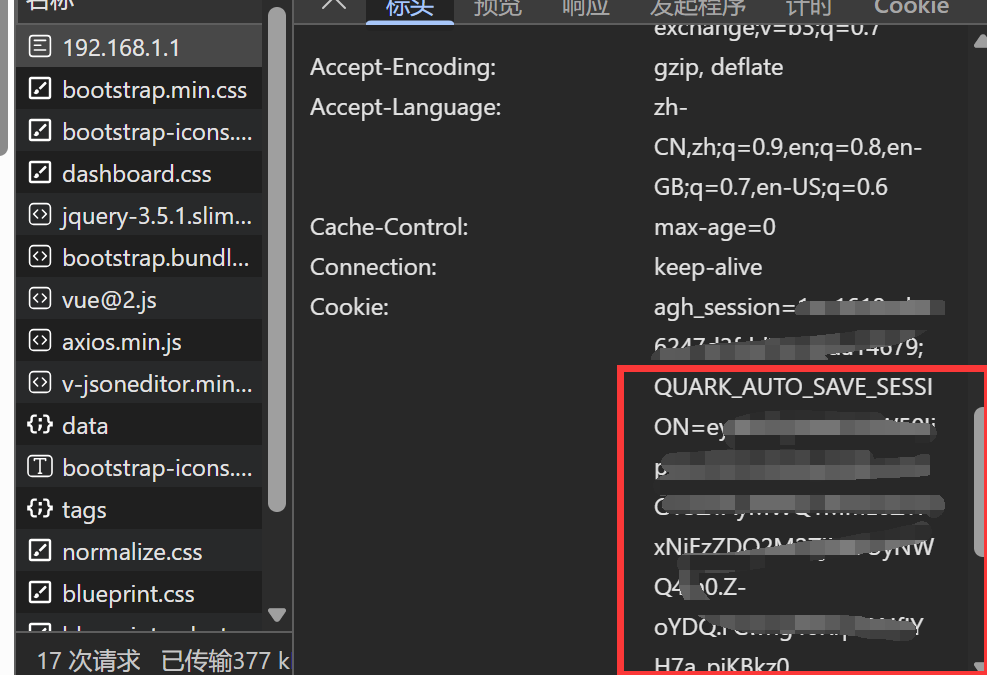
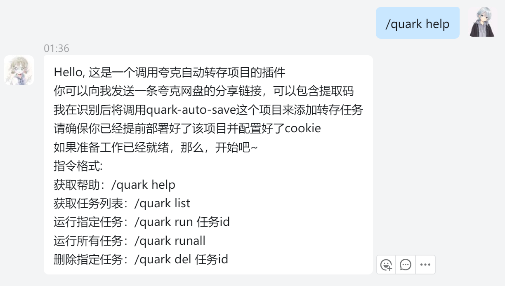
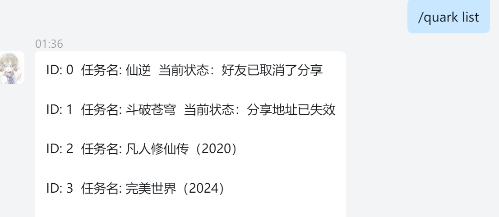
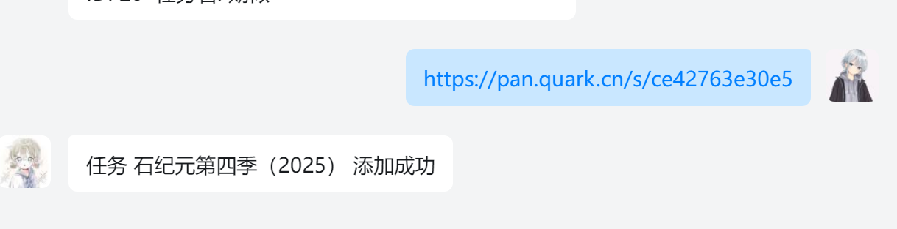
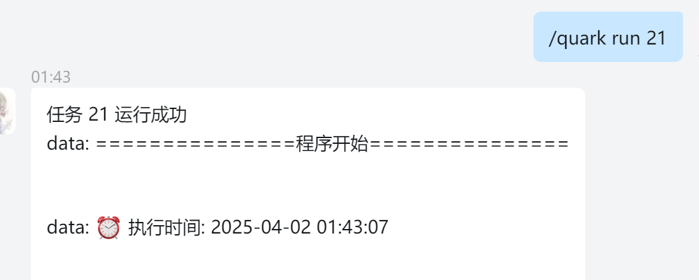

# Astrbot_plugin_quarksave

AstrBot 插件 -- 调用 [quark_auto_save](https://github.com/Cp0204/quark-auto-save) 实现自动转存资源到夸克网盘

## 使用方式

安装插件，填写 cookie 和 quark_auto_save 的URL地址，然后发送一条带有夸克链接的消息给机器人即可，理论支持全平台，发送链接给机器人仅支持私聊

## 指令介绍

1. 获取任务列表

```
/quark list
```

2. 获取指定任务详情

```
/quark detail taskid
```

3. 运行单个任务

```
/quark detail taskid
```

4. 运行所有任务

```
/quark runall
```

5. 删除指定任务

```
/quark del taskid
```

6. 重命名任务

```
/quark rename taskid 新名字
```

7. 修改任务目录

```
/quark update_dir taskid 目录
```

8. 修改任务链接

```
/quark update_link taskid 链接
```

9. 更新任务子目录正则表达式

```
/quark update_subdir taskid 子目录正则表达式
```

10. 帮助

```
/quark help
```
### cookie获取方式

按F12打开控制台，切换到网络选项卡，刷新网页后找到任意请求，找到cookie，复制 **QUARK_AUTO_SAVE_SESSION=** 后面的内容即可，其余的不要



## 项目截图

1. 帮助


2. 获取任务列表


3. 添加任务


4. 运行任务
