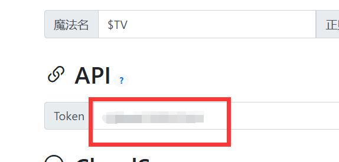

# Astrbot_plugin_quarksave

[AstrBot](https://astrbot.app/) 插件 -- 调用 [quark_auto_save](https://github.com/Cp0204/quark-auto-save) 实现自动转存资源到夸克网盘

项目地址：
[Github](https://github.com/lm379/astrbot_plugin_quarksave) 
[Gitee](https://gitee.com/lm379/astrbot_plugin_quarksave)

## 使用方式

安装插件，目前已经上架astrbot插件市场，填写 API Token 和 quark_auto_save 的URL地址，然后发送一条带有夸克链接的消息给机器人即可，理论支持全平台

觉得好用的话，点个Star吧~~

若无法访问github，可前往gitee下载源码后手动安装

**注意，本插件只允许在私聊中使用，且仅允许管理员调用，请在使用前给机器人发送 `/sid` 获取用户id后，在astrbot后台添加，否则无法使用**

```bash
cd AstrBot/data/plugins
git clone https://gitee.com/lm379/astrbot_plugin_quarksave.git
```

> [!CAUTION]   
> ⛔️⛔️⛔️ 由于 quark-auto-save 在新版本中加入了API Token授权，现在已经移除了原有的cookie授权模式，改为了项目的 API Token授权，请更新项目至 **0.5.0** 版本以上    
> 另外，由于QQ机器人官方接口限制外链发送，若使用QQ机器人官方接口，部分指令发送后会无响应！！！

## 指令介绍

1. 获取任务列表

```
/quark list
```

2. 获取指定任务详情

```
/quark detail taskid
```

3. 运行单个任务

```
/quark detail taskid
```

4. 运行所有任务

```
/quark runall
```

5. 删除指定任务

```
/quark del taskid
```

6. 重命名任务

```
/quark rename taskid 新名字
```

7. 修改任务目录

```
/quark update_dir taskid 目录
```

8. 修改任务链接

```
/quark update_link taskid 链接
```

9. 更新任务子目录正则表达式

```
/quark update_subdir taskid 子目录正则表达式
```

10. 帮助

```
/quark help
```
### API Token 获取方式

进入quark-auto-save后台，在系统配置下找到API Token，将Token复制过来即可

<!-- 按F12打开控制台，切换到网络选项卡，刷新网页后找到任意请求，找到cookie，复制 **QUARK_AUTO_SAVE_SESSION=** 后面的内容即可，其余的不要 -->



## 项目截图

1. 帮助


2. 获取任务列表


3. 添加任务


4. 运行任务


## 更新记录

### v1.0.2

适配API Token授权模式 (需上游项目 **v0.5.0** 版本及以上)  
重构整体代码，修复部分bug

## Todo List

适配天翼云盘和百度网盘的转存项目